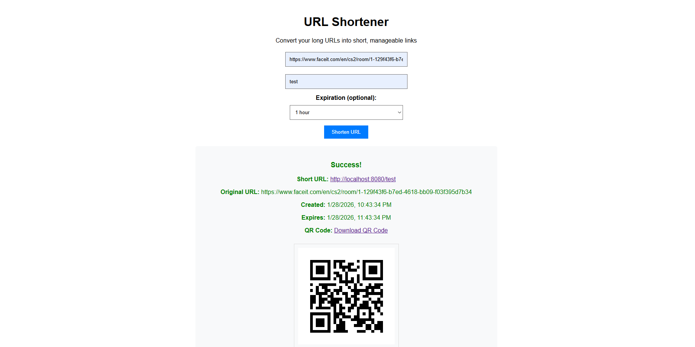
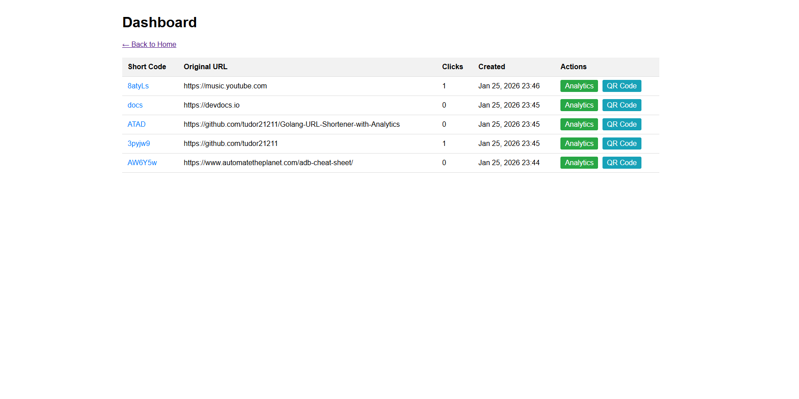
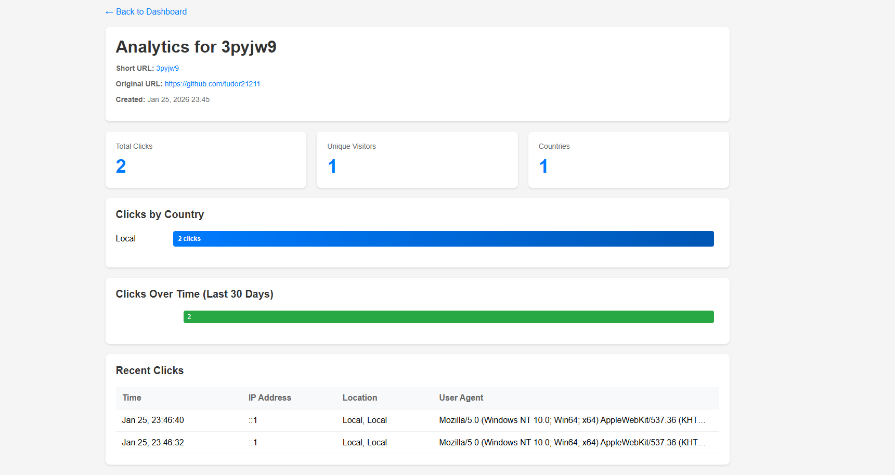

# URL Shortener with Analytics

A URL shortening service built with Go that converts long URLs into short links and provides analytics on click-through rates, visitor locations, and usage patterns.



## Features

### URL Management
- Shorten long URLs into 6-character codes (over 56 billion possible combinations)
- Create custom short codes with 3-20 alphanumeric characters
- Set optional expiration dates for temporary links
- Automatic collision detection with retry mechanism

### Analytics
- Track total clicks and unique visitors per link
- Geographic data showing visitor countries and cities via IP geolocation
- Daily click trends for the last 30 days
- Recent activity log with IP addresses and user agents

### Interface
- Web dashboard to manage all shortened URLs
- QR code generation for mobile sharing
- RESTful API for programmatic access
- Rate limiting (10 requests per minute per IP)

### Technical Details
- Built with Go for performance
- SQLite database (no external database required)
- CORS and security middleware
- Pure Go dependencies (no CGO required)

## Screenshots

### Homepage


### Dashboard


### Analytics


### QR Code


## Installation

Clone the repository:
```bash
git clone https://github.com/yourusername/Golang-URL-Shortener-with-Analytics.git
cd Golang-URL-Shortener-with-Analytics
```

Install dependencies:
```bash
go mod tidy
```

Run the application:
```bash
go run ./cmd/main.go
```

The server will start on `http://localhost:8080`

## API Usage

### Shorten a URL
```http
POST /api/v1/shorten
Content-Type: application/json

{
  "original_url": "https://example.com/very/long/url",
  "custom_code": "mylink",
  "expires_at": "2026-12-31T23:59:59Z"
}
```

### Get Analytics
```http
GET /api/v1/analytics/{shortCode}
```

Returns JSON with click statistics, geographic data, and recent activity.

### Generate QR Code
```http
GET /api/v1/qr/{shortCode}
```

Returns a PNG image of the QR code.

## Project Structure

```
├── cmd/
│   └── main.go              # Application entry point
├── internal/
│   ├── database/            # Database connection and setup
│   ├── handlers/            # HTTP request handlers
│   ├── middleware/          # Rate limiting, CORS, logging
│   ├── models/              # Data structures
│   └── services/            # Business logic
├── tests/                   # Test suite
└── docs/                    # Documentation
```

## Testing

Run the test suite:
```bash
go test ./tests/... -v
```

## Dependencies

- [gorilla/mux](https://github.com/gorilla/mux) - HTTP router
- [modernc.org/sqlite](https://gitlab.com/cznic/sqlite) - Pure Go SQLite driver
- [skip2/go-qrcode](https://github.com/skip2/go-qrcode) - QR code generation

## License

MIT License